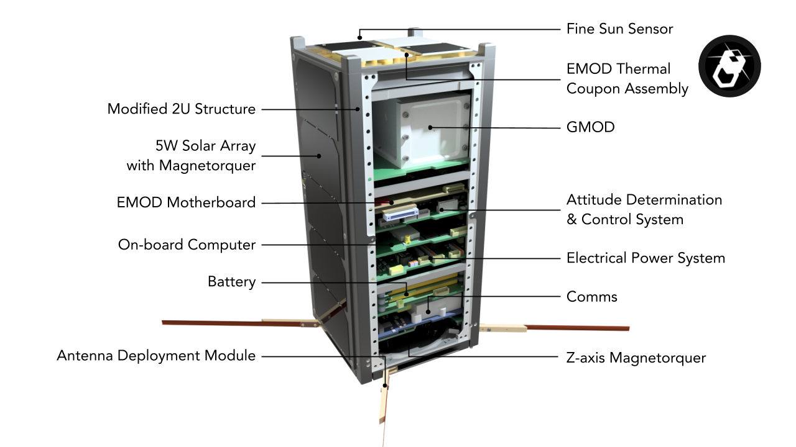
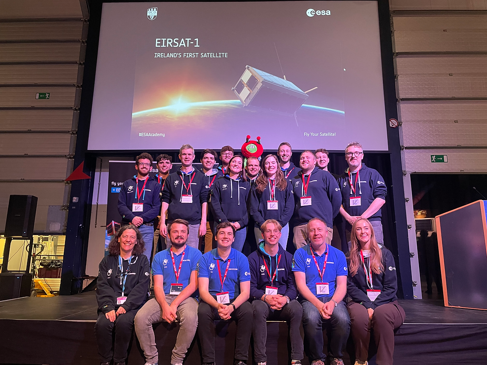
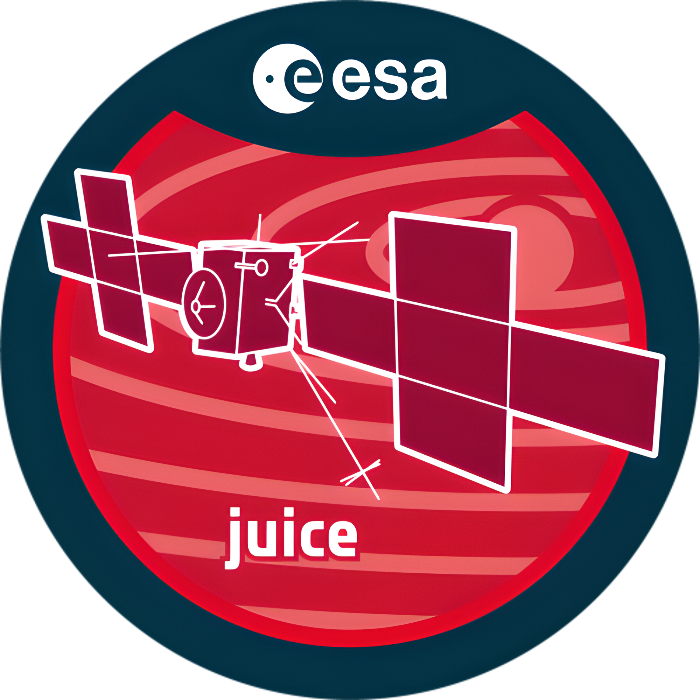

theme: Fira, 1

# Round 1
## Answers

---

# Question 1

How many squares with bridges are there?

---
### Question 1 Answer

3

---

# Question 2
What was the highest grossing film of 2024?

(As of 2023-11-26)

---
### Question 2 Answer

Barbie, $1.4 billion

- [`https://en.wikipedia.org/wiki/2023_in_film`](https://en.wikipedia.org/wiki/2023_in_film)

---

# Question 3
What is the name of the first Irish satellite, due to be launch 1st December, 2023?

Bonus: What does the acronym stand for?

---
### Question 3 Answer

EIRSAT-1

> Educational Irish Research Satellite

- [`https://www.eirsat1.ie/`](https://www.eirsat1.ie/)

---

# Question 4
What is widely regarded as the world's first computer virus and displayed a simple message ending with 'CATCH ME IF YOU CAN!'?

---
### Question 4 Answer

Creeper

- [`https://www.kaspersky.com/resource-center/threats/a-brief-history-of-computer-viruses-and-what-the-future-holds`](https://www.kaspersky.com/resource-center/threats/a-brief-history-of-computer-viruses-and-what-the-future-holds)

- [`https://en.wikipedia.org/wiki/Computer_virus`](https://en.wikipedia.org/wiki/Computer_virus)

---

# Question 5
Who first discussed the idea of computer viruses? Clue: Their work went on to be shared in a series of lectures under the catch title of "Theory and Organization of Complicated Automata".

---
### Question 5 Answer

John von Neumann

- [`https://www.kaspersky.com/resource-center/threats/a-brief-history-of-computer-viruses-and-what-the-future-holds`](https://www.kaspersky.com/resource-center/threats/a-brief-history-of-computer-viruses-and-what-the-future-holds)

- [`https://en.wikipedia.org/wiki/Computer_virus`](https://en.wikipedia.org/wiki/Computer_virus)

---

# Question 6
Sam Bankman-Fried, the recently convicted ex-CEO of the crypto exchange FTX was known to play what game while on calls with investors?

Hint: the Financial Times classed his win ratio as “average-to-bad”

---
### Question 6 Answer

League of Legends

- [`https://www.ft.com/content/23ab2258-ce03-4fbb-a9b2-7d9ec6e3d7f0`](https://www.ft.com/content/23ab2258-ce03-4fbb-a9b2-7d9ec6e3d7f0)

- [`https://en.wikipedia.org/wiki/Sam_Bankman-Fried`](https://en.wikipedia.org/wiki/Sam_Bankman-Fried)

---

# Question 7
Name the film, game or TV series in which the following spaceship plays a role:

Nostromo

---
### Question 7 Answer

Alien

- [`https://en.wikipedia.org/wiki/List_of_fictional_spacecraft`](https://en.wikipedia.org/wiki/List_of_fictional_spacecraft)

---

# Question 8
Which fizzy soft drink can be used to visually represent a character in a 2D computer game?

---
### Question 8 Answer

sprite

- [`https://en.wikipedia.org/wiki/Sprite_(computer_graphics)`](https://en.wikipedia.org/wiki/Sprite_(computer_graphics))

---

# Question 9
The game Half-Life was released 25 years ago.

In it you play the scientist Gordon Freeman who is attempting to escape a resarch facility after an experiment goes terribly wrong.

What was the name of the research facility the game is set in?

---
### Question 9 Answer

# Black Mesa

(or Black Mesa Research Facility)

- [`https://en.wikipedia.org/wiki/Half-Life_(video_game)`](https://en.wikipedia.org/wiki/Half-Life_(video_game))

---

# Question 10
The Jupiter Icy Moons Explorer (Juice) is an interplanetary spacecraft that was launched on 14 April 2023 by the European Space Agency to explore Jupiter and its moons

When is it expected to reach Jupiter?

a. 2031
b. 2038
c. 2040

---
### Question 10 Answer

# a. 2031

It is expected to reach Jupiter in July 2031 after four gravity assists and eight years of travel.

- [`https://en.wikipedia.org/wiki/Jupiter_Icy_Moons_Explorer`](https://en.wikipedia.org/wiki/Jupiter_Icy_Moons_Explorer)

---
