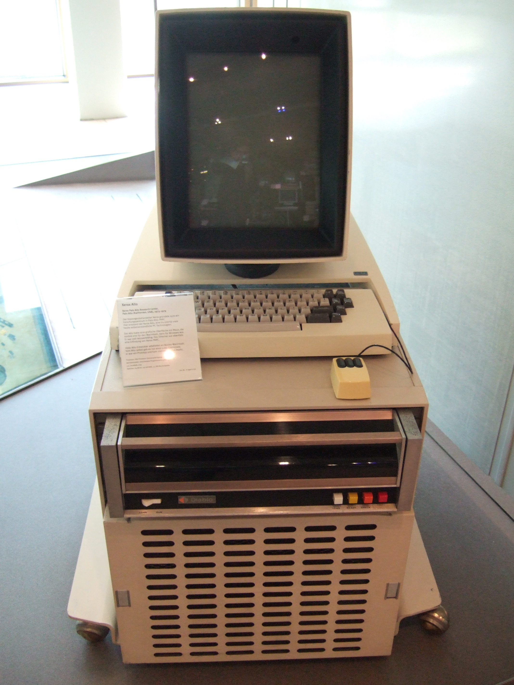
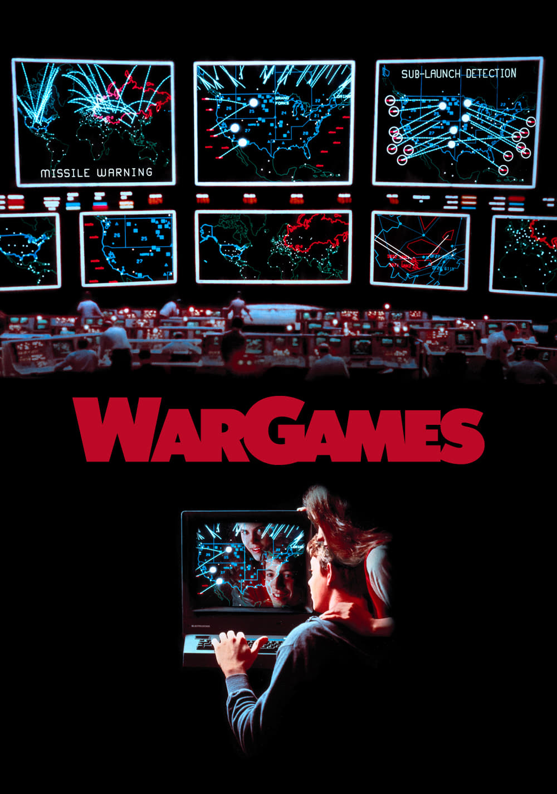

theme: Fira, 3

# Round 3
## Answers

---

# Question 1

How many squares with buses are there?

---
### Question 1 Answer

16 or None

- [`https://mastodon.social/@jemjabella/111204496899609794`](https://mastodon.social/@jemjabella/111204496899609794)

---

# Question 2
In what year did we first run this table quiz?

a. 2005
b. 2010
c. 2016

---
### Question 2 Answer

c. 2010

---

# Question 3
Name the film, game or TV series in which the following spaceship plays a role:

# USS Cerritos

---
### Question 3 Answer

# Star Trek: Lower Decks

(or Lower Decks)

- [`https://en.wikipedia.org/wiki/List_of_fictional_spacecraft`](https://en.wikipedia.org/wiki/List_of_fictional_spacecraft)

---

# Question 4
We love QR codes and you've probably scanned a fair few of them. But was does QR stand for?

Bonus: For what purpose were QR codes invented?

---
### Question 4 Answer

Quick Response

Bonus: For labelling automobile parts

- [`https://en.wikipedia.org/wiki/QR_code`](https://en.wikipedia.org/wiki/QR_code)

---

# Question 5
Red Hat is famous for its Linux distribution and hat logo

This year it celebrated a major anniversary

What year was it founded?

---
### Question 5 Answer

# Founded in 1993

30 years ago

---

# Question 6
How Many Buttons were on the Original NES controller (including the D-pad)

a.   4
b.   5
c.   8
d.   10
e.   15

---
### Question 6 Answer

# c.   8

---

# Question 7
Autonomous taxi company Cruise recently lost their self-driving permits in California.

Before they lost their license what common object did protestors use to immobilize Cruise cars?

---
### Question 7 Answer

# Traffic Cone

> All it takes to render the technology-packed self-driving car inoperable is a traffic cone. If all goes according to plan, it will stay there, frozen, until someone comes and removes it.

- [`https://www.npr.org/2023/08/26/1195695051/driverless-cars-san-francisco-waymo-cruise`](https://www.npr.org/2023/08/26/1195695051/driverless-cars-san-francisco-waymo-cruise)

---

# Question 8
Software updates are important

NASA recently patched a famous space probe in October

What is it's name?

---
### Question 8 Answer

# Voyager

Voyager 2 to be precise, Voyager 1 will be patched later

After 46 years Voyager is still getting updates!

- [`https://arstechnica.com/space/2023/10/nasa-wants-the-voyagers-to-age-gracefully-so-its-time-for-a-software-patch/`](https://arstechnica.com/space/2023/10/nasa-wants-the-voyagers-to-age-gracefully-so-its-time-for-a-software-patch/)

---

# Question 9
50 years ago Xerox released the Xerox Alto, the computer many regarded as having defined Graphical User Interfaces as we know them

The Alto also marked the introduction of what networking technology?

---
### Question 9 Answer

# Ethernet

Created to allow Xerox Alto computers communicate with each other

- [`https://en.wikipedia.org/wiki/Xerox_Alto`](https://en.wikipedia.org/wiki/Xerox_Alto)

- [`https://en.wikipedia.org/wiki/Ethernet`](https://en.wikipedia.org/wiki/Ethernet)

- [`https://www.righto.com/2018/01/xerox-altos-3-mbs-ethernet-building.html`](https://www.righto.com/2018/01/xerox-altos-3-mbs-ethernet-building.html)

---

# Question 10
Which movie is this quote from?

> Shall we play a game?

Bonus: What is the name of the AI who said it?

---
### Question 10 Answer

# WarGames

## Bonus: JOSHUA

> the only winning move is not to play

- [`https://en.wikipedia.org/wiki/WarGames`](https://en.wikipedia.org/wiki/WarGames)

---
