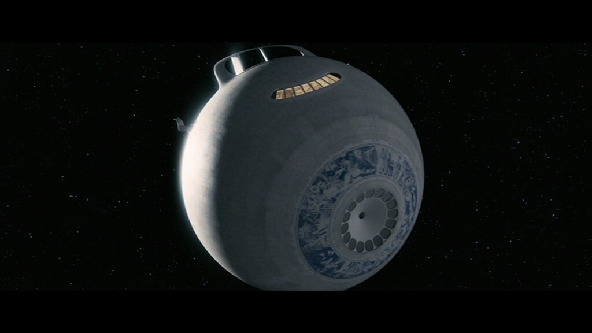
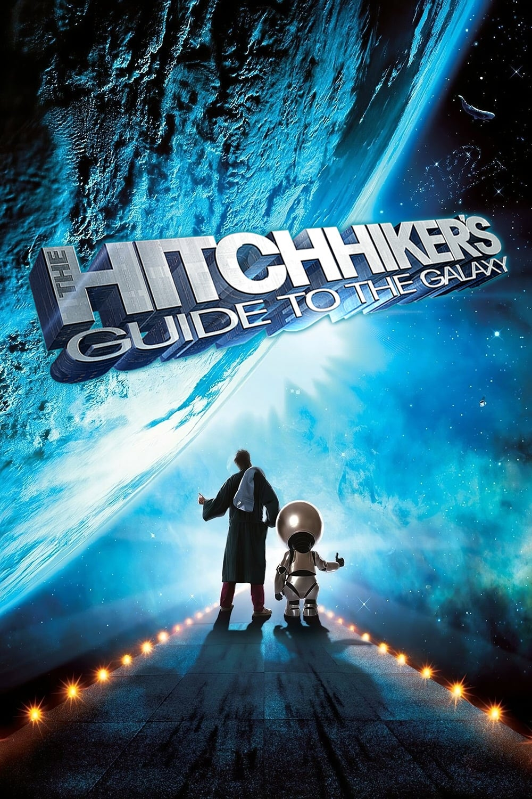

theme: Fira, 4

# Round 4
## Answers

---

# Question 1

How many squares with traffic lights are there?

a. None
b. 2

---
### Question 1 Answer

# b. 2

according to recaptcha

- [`https://twitter.com/ThatsMauvelous/status/1576675184165068800`](https://twitter.com/ThatsMauvelous/status/1576675184165068800)

---

# Question 2
Name the film, game or TV series in which the following spaceship plays a role:

# Heart of Gold

---
### Question 2 Answer

The Hitchhiker's Guide to the Galaxy

- [`https://en.wikipedia.org/wiki/List_of_fictional_spacecraft`](https://en.wikipedia.org/wiki/List_of_fictional_spacecraft)

---

# Question 3
The term "bug" was used in an account by computer pioneer Grace Hopper, who publicized the cause of a malfunction in an early electromechanical computer.

What bug (insect) was it?

---
### Question 3 Answer

Moth

- [`https://education.nationalgeographic.org/resource/worlds-first-computer-bug/`](https://education.nationalgeographic.org/resource/worlds-first-computer-bug/)

- [`https://en.wikipedia.org/wiki/Software_bug`](https://en.wikipedia.org/wiki/Software_bug)

---

# Question 4
Dave Tennant has reprised his role as the 14th Doctor in the recent Doctor Who specials.

Who will play the 15th Doctor in Doctor Who, starting this Christmas?

---
### Question 4 Answer

Ncuti Gatwa

- [`https://www.bbc.com/mediacentre/2023/doctor-who-new-trailer-60th-anniversary-specials`](https://www.bbc.com/mediacentre/2023/doctor-who-new-trailer-60th-anniversary-specials)

- [`https://en.wikipedia.org/wiki/The_Doctor_(Doctor_Who)`](https://en.wikipedia.org/wiki/The_Doctor_(Doctor_Who))

---

# Question 5
On the 23rd of August 2023 India became the 4th country to successfully do what in space?

---
### Question 5 Answer

# Land on the Moon

The mission consists of a lunar lander named Vikram and a lunar rover named Pragyan

- [`https://en.wikipedia.org/wiki/Chandrayaan-3`](https://en.wikipedia.org/wiki/Chandrayaan-3)

---

# Question 6
Amazing languages like Elixir and Erlang run on a virtual machine called the BEAM.

It is not as creatively named as the JVM but nonetheless what does BEAM stand for?

---
### Question 6 Answer

It was short for Bogdan's Erlang Abstract Machine

(Björn's Erlang Abstract Machine is also acceptable)

- [`https://en.wikipedia.org/wiki/BEAM_(Erlang_virtual_machine)`](https://en.wikipedia.org/wiki/BEAM_(Erlang_virtual_machine))

---

# Question 7
Collectors of Bored Ape NFT recently attended an "ApeFest" event in Hong Kong, which culminated in a concert.

After the concert some attendees complained about excrutiating pain in which part of the body?

---
### Question 7 Answer

# Eyes 👀

- [`https://web3isgoinggreat.com/?id=apefest-photokeratitis`](https://web3isgoinggreat.com/?id=apefest-photokeratitis)

---

# Question 8
By views in the first 91 days, what is the most popular show on Netflix (in English)?

a. Stranger Things 4
b. Bridgerton: Season 1
c. Wednesday: Season 1

---
### Question 8 Answer

# c. Wednesday: Season 1

(Only beaten by Squid Game (non-English))

- [`https://www.netflix.com/tudum/top10/most-popular/tv?week=2023-11-26`](https://www.netflix.com/tudum/top10/most-popular/tv?week=2023-11-26)

---

# Question 9
Apple's recent October 30th keynote was the usual slickly produced sales event

There was something different about how this event was produced.

What was different?

---
### Question 9 Answer

# Filmed entirely on a phone

- [`https://www.apple.com/newsroom/2023/10/behind-the-scenes-at-scary-fast-apples-keynote-event-shot-on-iphone/`](https://www.apple.com/newsroom/2023/10/behind-the-scenes-at-scary-fast-apples-keynote-event-shot-on-iphone/)

---

# Question 10
During a recent spacewalk outside the International Space Station what got dropped?

---
### Question 10 Answer

# A toolbag

- [`https://www.theguardian.com/science/2023/nov/11/astronaut-toolbag-earth-spacewalk`](https://www.theguardian.com/science/2023/nov/11/astronaut-toolbag-earth-spacewalk)

---
