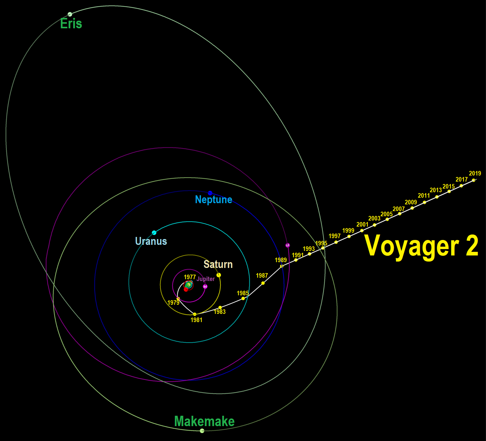

theme: Fira, 5

# Tie-Breaker
## Answers

---

# Question 1
Voyager 2 is currently in interstellar space

To the closest whole AU, how far away is Voyager 2 from Earth?

1 AU is the distance from the Earth to the Sun

Write it down in secret so we can compare!

---
### Question 1 Answer

# 134 AU

It is at a distance of 134 AU (20 billion km; 12 billion mi) from Earth as of November 2023.

---

# Question 2
Voyager 1 is the furthest man made object from Earth

To the closest whole AU, how far away is Voyager 1 from Earth?

Write it down in secret so we can compare!

---
### Question 2 Answer

# 162 AU

---
