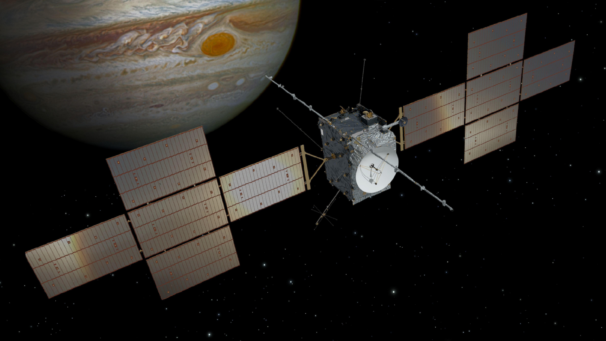
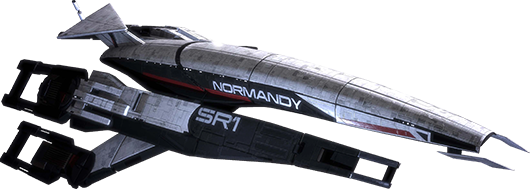

theme: Fira, 

# Round 1
## Questions

---

# Question 1

How many squares with bridges are there?

---

# Question 2
What was the highest grossing film of 2024?

(As of 2023-11-26)

---

# Question 3
What is the name of the first Irish satellite, due to be launch 1st December, 2023?

Bonus: What does the acronym stand for?

---

# Question 4
What is widely regarded as the world's first computer virus and displayed a simple message ending with 'CATCH ME IF YOU CAN!'?

---

# Question 5
Who first discussed the idea of computer viruses? Clue: Their work went on to be shared in a series of lectures under the catch title of "Theory and Organization of Complicated Automata".

---

# Question 6
Sam Bankman-Fried, the recently convicted ex-CEO of the crypto exchange FTX was known to play what game while on calls with investors?

Hint: the Financial Times classed his win ratio as “average-to-bad”

---

# Question 7
Name the film, game or TV series in which the following spaceship plays a role:

Nostromo

---

# Question 8
Which fizzy soft drink can be used to visually represent a character in a 2D computer game?

---

# Question 9
The game Half-Life was released 25 years ago.

In it you play the scientist Gordon Freeman who is attempting to escape a resarch facility after an experiment goes terribly wrong.

What was the name of the research facility the game is set in?

---

# Question 10
The Jupiter Icy Moons Explorer (Juice) is an interplanetary spacecraft that was launched on 14 April 2023 by the European Space Agency to explore Jupiter and its moons

When is it expected to reach Jupiter?

a. 2031
b. 2038
c. 2040

---

# Round 2
## Questions

---

# Question 1
The long running TV series Doctor Who celebrated its what anniversary this year?

---

# Question 2
Spider-Man: Across the Spider-Verse used what open source 3D modelling tool for some of its animation?

---

# Question 3
In what decade was the first working transistor invented?

a. 1930s
b. 1940s
c. 1950s
d. 1960s

---

# Question 4
Name the film, game or TV series in which the following spaceship plays a role:

# Normandy SR-1

---

# Question 5
Chips, chips or chips! Which of these is a potato chip (ie. crisps, eaten unheated), a proper chip (ie. chipper chips, eaten hot) or a computer chip?

- Fatter Agnus
- Funyon
- Poutine

1 point per correct answer

---

# Question 6
Know your meme: fill in the blank:

### Sci-Fi Author: In my book I invented the ___ ___ as a cautionary tale

### Tech Company: At long last, we have created the ___ ___ from classic sci-fi novel Don't Create The ___ ___

(Same answer for all blanks)

---

# Question 7
Complete the following:

> A badger, badger
> Badger, badger, badger
> Badger, badger, badger
> Badger, badger, badger
> _____, ______!

---

# Question 8
Metal Gear Solid is an action adventure stealth game created by Hideo Kojima

It was released on the Playstation how many years ago?

a. 20 years ago
b. 25 years ago
c. 30 years ago

---

# Question 9
On September 24th the sample return module from NASA's OSIRIS-REx mission successfully touched back down on Earth.

Inside were samples successfully retrieved from a near Earth asteroid

What was the name of the asteroid it took samples from?

---

# Question 10
A bitcoiner recently made history for the largest transaction fee in Bitcoin history.

How much was it?

a. ~$500,000
b. ~$1,000,000
c. ~$3,000,000

---

# Round 3
## Questions

---

# Question 1

How many squares with buses are there?

---

# Question 2
In what year did we first run this table quiz?

a. 2005
b. 2010
c. 2016

---

# Question 3
Name the film, game or TV series in which the following spaceship plays a role:

# USS Cerritos

---

# Question 4
We love QR codes and you've probably scanned a fair few of them. But was does QR stand for?

Bonus: For what purpose were QR codes invented?

---

# Question 5
Red Hat is famous for its Linux distribution and hat logo

This year it celebrated a major anniversary

What year was it founded?

---

# Question 6
How Many Buttons were on the Original NES controller (including the D-pad)

a.   4
b.   5
c.   8
d.   10
e.   15

---

# Question 7
Autonomous taxi company Cruise recently lost their self-driving permits in California.

Before they lost their license what common object did protestors use to immobilize Cruise cars?

---

# Question 8
Software updates are important

NASA recently patched a famous space probe in October

What is it's name?

---

# Question 9
50 years ago Xerox released the Xerox Alto, the computer many regarded as having defined Graphical User Interfaces as we know them

The Alto also marked the introduction of what networking technology?

---

# Question 10
Which movie is this quote from?

> Shall we play a game?

Bonus: What is the name of the AI who said it?

---

# Round 4
## Questions

---

# Question 1

How many squares with traffic lights are there?

a. None
b. 2

---

# Question 2
Name the film, game or TV series in which the following spaceship plays a role:

# Heart of Gold

---

# Question 3
The term "bug" was used in an account by computer pioneer Grace Hopper, who publicized the cause of a malfunction in an early electromechanical computer.

What bug (insect) was it?

---

# Question 4
Dave Tennant has reprised his role as the 14th Doctor in the recent Doctor Who specials.

Who will play the 15th Doctor in Doctor Who, starting this Christmas?

---

# Question 5
On the 23rd of August 2023 India became the 4th country to successfully do what in space?

---

# Question 6
Amazing languages like Elixir and Erlang run on a virtual machine called the BEAM.

It is not as creatively named as the JVM but nonetheless what does BEAM stand for?

---

# Question 7
Collectors of Bored Ape NFT recently attended an "ApeFest" event in Hong Kong, which culminated in a concert.

After the concert some attendees complained about excrutiating pain in which part of the body?

---

# Question 8
By views in the first 91 days, what is the most popular show on Netflix (in English)?

a. Stranger Things 4
b. Bridgerton: Season 1
c. Wednesday: Season 1

---

# Question 9
Apple's recent October 30th keynote was the usual slickly produced sales event

There was something different about how this event was produced.

What was different?

---

# Question 10
During a recent spacewalk outside the International Space Station what got dropped?

---

# Tie-Breaker
## Questions

---

# Question 1
Voyager 2 is currently in interstellar space

To the closest whole AU, how far away is Voyager 2 from Earth?

1 AU is the distance from the Earth to the Sun

Write it down in secret so we can compare!

---

# Question 2
Voyager 1 is the furthest man made object from Earth

To the closest whole AU, how far away is Voyager 1 from Earth?

Write it down in secret so we can compare!

---

