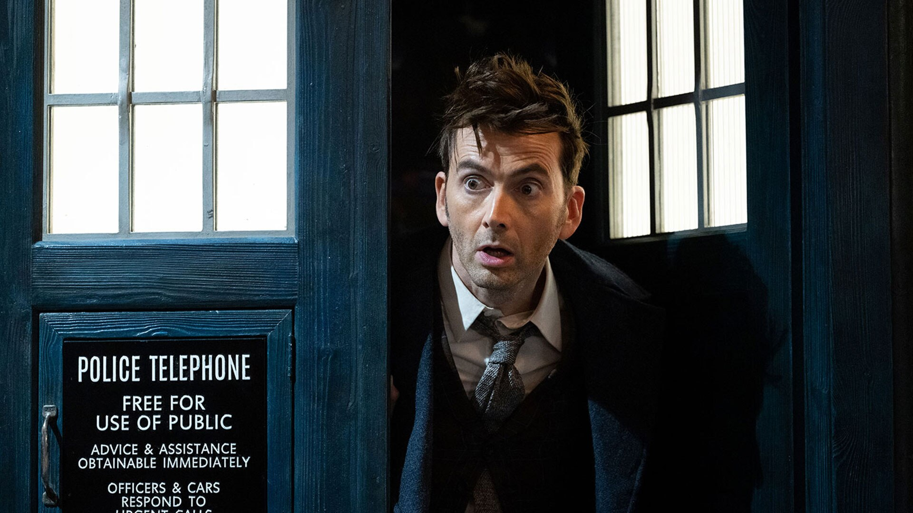

theme: Fira, 2

# Round 2
## Questions

---

# Question 1
The long running TV series Doctor Who celebrated its what anniversary this year?

---

# Question 2
Spider-Man: Across the Spider-Verse used what open source 3D modelling tool for some of its animation?

---

# Question 3
In what decade was the first working transistor invented?

a. 1930s
b. 1940s
c. 1950s
d. 1960s

---

# Question 4
Name the film, game or TV series in which the following spaceship plays a role:

# Normandy SR-1

---

# Question 5
Chips, chips or chips! Which of these is a potato chip (ie. crisps, eaten unheated), a proper chip (ie. chipper chips, eaten hot) or a computer chip?

- Fatter Agnus
- Funyon
- Poutine

1 point per correct answer

---

# Question 6
Know your meme: fill in the blank:

### Sci-Fi Author: In my book I invented the ___ ___ as a cautionary tale

### Tech Company: At long last, we have created the ___ ___ from classic sci-fi novel Don't Create The ___ ___

(Same answer for all blanks)

---

# Question 7
Complete the following:

> A badger, badger
> Badger, badger, badger
> Badger, badger, badger
> Badger, badger, badger
> _____, ______!

---

# Question 8
Metal Gear Solid is an action adventure stealth game created by Hideo Kojima

It was released on the Playstation how many years ago?

a. 20 years ago
b. 25 years ago
c. 30 years ago

---

# Question 9
On September 24th the sample return module from NASA's OSIRIS-REx mission successfully touched back down on Earth.

Inside were samples successfully retrieved from a near Earth asteroid

What was the name of the asteroid it took samples from?

---

# Question 10
A bitcoiner recently made history for the largest transaction fee in Bitcoin history.

How much was it?

a. ~$500,000
b. ~$1,000,000
c. ~$3,000,000

---
