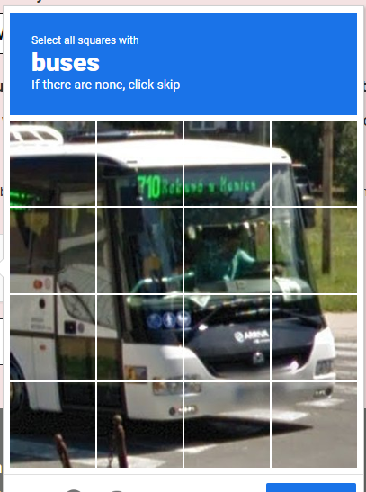
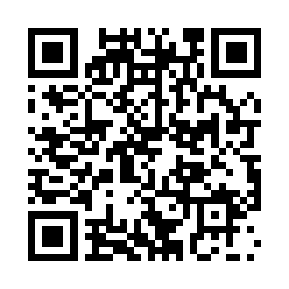
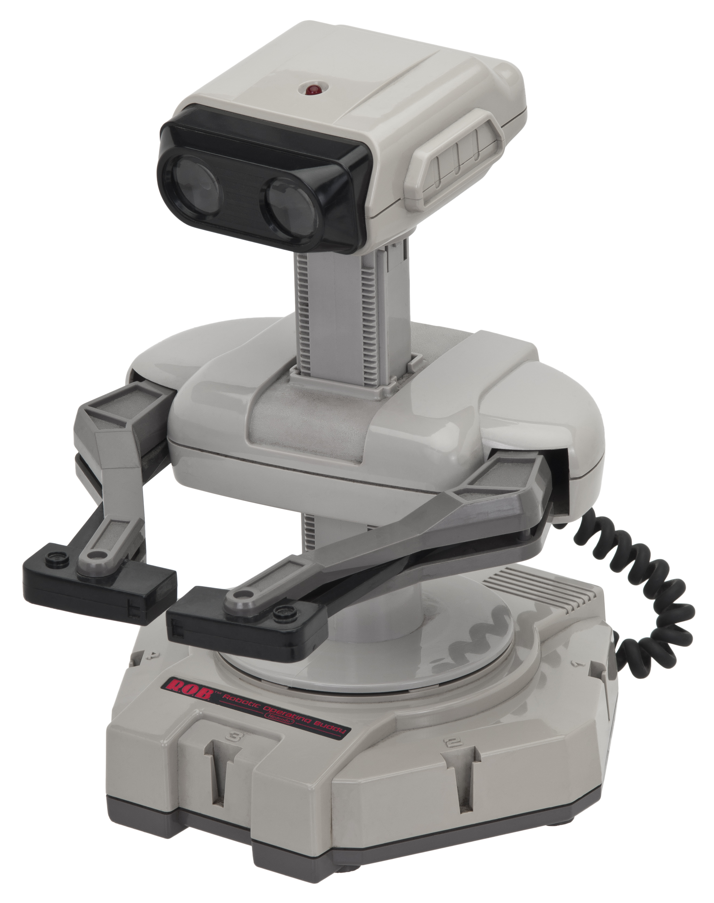

theme: Fira, 3

# Round 3
## Questions

---

# Question 1

How many squares with buses are there?

---

# Question 2
In what year did we first run this table quiz?

a. 2005
b. 2010
c. 2016

---

# Question 3
Name the film, game or TV series in which the following spaceship plays a role:

# USS Cerritos

---

# Question 4
We love QR codes and you've probably scanned a fair few of them. But was does QR stand for?

Bonus: For what purpose were QR codes invented?

---

# Question 5
Red Hat is famous for its Linux distribution and hat logo

This year it celebrated a major anniversary

What year was it founded?

---

# Question 6
How Many Buttons were on the Original NES controller (including the D-pad)

a.   4
b.   5
c.   8
d.   10
e.   15

---

# Question 7
Autonomous taxi company Cruise recently lost their self-driving permits in California.

Before they lost their license what common object did protestors use to immobilize Cruise cars?

---

# Question 8
Software updates are important

NASA recently patched a famous space probe in October

What is it's name?

---

# Question 9
50 years ago Xerox released the Xerox Alto, the computer many regarded as having defined Graphical User Interfaces as we know them

The Alto also marked the introduction of what networking technology?

---

# Question 10
Which movie is this quote from?

> Shall we play a game?

Bonus: What is the name of the AI who said it?

---
